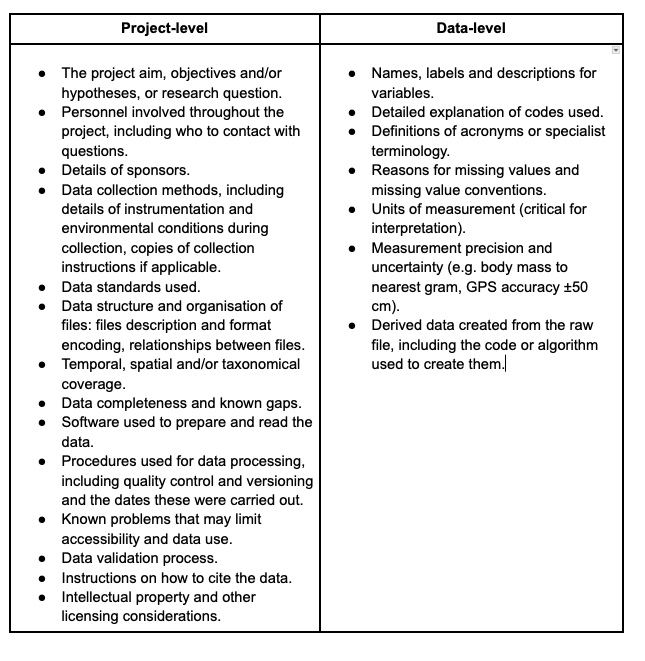

# Documenting {#sec-documenting}

Datasets are valuable but rarely self-explanatory. Essential contextual information, such as how variables were measured or how missing values were handled, is often only recorded in field notebooks or the researcher’s memory, and is easily lost over time. Good documentation prevents this and helps ensure the data are FAIR (see FAIR Box).

## How do you document data? 

There are several complementary ways to document data.

**README files**. (README Box). A README is a human-readable document, often a .txt file, that provides a narrative description of the dataset, including its purpose, structure, and how it should be used.  A well-structured README is the first step toward clear and reusable data documentation, and can serve as a foundation for more formal metadata standards. There are several tools, guides and templates for the creation of README files, for example the [McMaster University README Generator](https://rdm.mcmaster.ca/readme) and [READMEBuilder](https://github.com/EIvimeyCook/READMEBuilder). We also provide an example here (README example box).

**Data dictionaries**. A data dictionary (or codebook) might be a separate document or it might form part of your README. The purpose of a data dictionary is to explain what all the variable names and values in your data files mean. They usually include variable names, measurement units, definitions of the variable, allowed values etc. Some useful guidelines are available [here](https://help.osf.io/article/217-how-to-make-a-data-dictionary).

**Metadata**. Datasets should also be documented using metadata, commonly defined as “data about data”. Metadata provides essential context for understanding and effectively reusing datasets[^13], with structured descriptions covering a dataset’s content and context, such as title, creator, date, keywords, spatial and temporal coverage, and license. In most cases, this is created using standardised deposit forms, and increases the chances that your data will be found and correctly reused by others, including automated systems. 

These forms of documentation serve complementary roles. README files and data dictionaries are mainly written for people and help users quickly understand what the dataset contains and how to use it. In contrast, structured metadata are designed to be read by both humans and machines, enabling data to be more easily discovered, shared, and integrated across systems. While a README file represents a minimum level of documentation, metadata are essential for improving data discoverability and reuse, particularly in repositories and automated workflows. In practice, both approaches should be used together: the README (and data dictionaries) for clarity, and metadata for standardisation and interoperability. 

Note that definitions of metadata vary. Some people would include READMEs and data dictionaries in their definition of metadata, others say metadata only includes machine-readable, structured data about data files. Ultimately it doesn’t matter too much what you call things, as long as you provide all the documentation needed.

::: callout-tip

### What should be in a good README?

- A clear description of the data and, if relevant, the publications it is associated with, any authors of these publications and their ORCIDs where possible.
- Contact details of at least one author, including their ORCID.
- License information. Note that this should also be provided as a separate LICENSE file.
- Recommended citation for the data, ideally also include a dedicated [CITATION.cff](https://citation-file-format.github.io/) file.
- Detailed contributions to the data, following [CRediT taxonomy](https://credit.niso.org/).
- A concise description of which data files are needed to reproduce specific analyses/figures/tables in any associated papers, and any proprietary software required.
- A brief, but specific, summary of how the data were collected, from where, and when (as appropriate).
- Sources of data if it was from a literature review.
- A list of all data files, whether they contain raw or processed/cleaned/summarised data, and briefly what they contain, e.g. life history variables.
- Column-by-column description of the data files, along with column headers, measurement units, allowed options for categorical variables, reference schemes for controlled vocabulary, explanations of any abbreviations, identifiers that relate observations across separate data files, and missing-data codes. 
- You should also have a README for your code, or one for the code and data combined. - You should refer to any scripts used to process your data, and what these processing steps involve. See [BES Reproducible Code]( https://www.britishecologicalsociety.org/wp-content/uploads/2025/12/BES-Reproducible-code-guide_2025.pdf) guide.

:::

## How much documentation is enough?

Beyond facilitating reuse, the process of creating documentation can also improve data quality by revealing inconsistencies, clarifying assumptions, and supporting reproducible workflows. However, documenting data also comes with costs, particularly the time and effort required to produce and maintain documentation. This raises an important question: what is the minimum level of documentation a dataset should have? While it depends on the objective, a well-documented dataset should include enough information that others (and/or future you!) can understand and reuse the data without contacting the original authors. 

In general, the appropriate level of documentation depends on the complexity of the data, its intended use and audience, repository requirements, and its expected longevity and reuse potential. A useful analogy is that of a library catalogue: a book is easier to find, identify, and evaluate when it is described with essential details such as title, author, subject, and year. However, metadata for datasets go further than cataloguing, as they also provide the contextual and methodological information needed to interpret and reuse the data. 

At minimum, a well-documented ecological dataset should include in its documentation:

- General dataset information: Title, abstract, keywords, and authorship (ideally with ORCID identifiers).
- Temporal and/or spatial coverage: Dates must follow standard formats like ISO 8601 (YYYY-MM-DD HH:MM). Geographic locations should include coordinates and reference systems. Field data should also specify the season where data were collected over multiple study seasons. 
- Methods and protocols: This includes sampling designs, lab protocols, data cleaning steps, and the software or scripts used.
- Data structure and variables: A clear description of each file and its relationship to others is necessary. Crucially, every variable must be defined with its name, data type, and units of measurement.

## Metadata standards

When documenting data, researchers can draw on general-purpose standards (e.g. ISO 8601 for dates and times) and domain-specific standards developed for particular fields. Some commonly used standards are: 

- Darwin Core (DwC): a standard for biodiversity data, particularly species occurrences, taxonomic information, and sampling events[^14][^15]. It provides a controlled vocabulary of terms (e.g., scientificName, eventDate, decimalLatitude) that standardise how biodiversity data are described and shared globally. 
- Ecological Metadata Language (EML): a flexible standard designed to describe ecological datasets at both the project and dataset levels[^16]. 
- Open Geospatial Consortium ([OGC](https://www.ogc.org/standards/)): standards for geographical data, including species occurrences. 

Importantly, while using standards is recommended, the priority is to ensure that data are well documented. Datasets do not need to be fully transformed into a specific standard to benefit from it. In many cases, mapping existing variables to standard terms is sufficient to improve interoperability without requiring a complete restructuring of the dataset.

Several tools exist to support the creation of metadata using standards without starting from scratch (see Tools for metadata creation and management box). 

::: callout-tip

### Tools for metadata creation and management

A range of tools are available to support the creation, standardization, and dissemination of metadata across ecological and biodiversity research:

- EMLassemblyline (R package): workflow-based tool for creating high quality Ecological Metadata Language (EML) metadata for dataset publication[^17]. 
- EML (R package): programmatic generation and validation of EML metadata[^18].
- emld (R package): conversion of EML metadata to JSON-LD and other web-friendly formats[^19].
- metapype-eml (Python): tools for generating EML metadata within Python workflows[^20].
- ezEML: web-based editor for creating EML metadata without programming.
- DELMa (R package): package for converting metadata statements written in R Markdown or Quarto markdown to EML[^21].
- NPSdataverse (R package): meta-package that provides a convenient way to download, install, and load many of the R packages needed to create and access data packages[^22].
- GBIF Integrated Publishing Toolkit (IPT): built-in metadata editor supporting Darwin Core Archives[^23].

:::

## Documentation at different levels: project-level and data-level 

Documentation can describe a project as a whole or a specific dataset. Both levels are important. While project-level documentation provides context for why data were collected, data-level documentation enables others to actually interpret and reuse the data. Together, they support transparency, reproducibility, and long-term data value (see FAIR box). 

::: border

### Documenting checklist

- [ ] Have you included a README file that includes all the recommended information?
- [ ] Have you created a data dictionary, or included this information in your README?
- [ ] Have you followed an established metadata standard that matches the type of data you are collecting (where appropriate)?
- [ ] Have you included enough documentation that others can understand and reuse the data? Get a colleague who is not familiar with the project to check. 

:::

::: border
## Example README

Your README may look different but should contain this sort of information.
----------
### README: Data for my awesome paper

Author(s): Me and my colleagues (me@myinstitution.ac.uk)

This repository contains all the data used in "My Awesome Paper" [link to published version]. Shared under a CC0 license.

To cite the paper: 
> Me and my colleagues. 2026. My Awesome Paper. Methods in Ecology and Evolution, 100: 1-10, DOI: [doi for paper]. 

To cite this dataset: 
> Me and my colleagues. 2026. Data from: My Awesome Paper v1.0. Zenodo. DOI: [doi for data].

### Data collection and processing (in brief)
[A brief description of how the data were collected]

All datasets use "NA" for missing data.

### Raw data
1. 2026-01-01_data-on-plants.csv
Contains all the data we collected on plants.

Column headers are as follows:
species. Species binomial name. 
date. In YYYY-MM-DD format.
growth_form. Categorical. Options are: Tree, Shrub, Vine, or Herb.
prop_cover. Proportion of quadrat covered by plant. Values between 0 and 1.

2. 2026-01-01_data-on-animals.csv
Contains all the data we collected on animals.

Column headers are as follows:
- species. Species binomial name. 
- number_legs. Number of legs. Count. 
- observation_height. Categorical. B = below ground; G = on the ground; T = in a tree.
- length_mm. Length of the animal from snout to vent in mm.

### Processed/cleaned data used in analyses
1.  2026-02-01_cleaned-data-on-plants-and-animals.csv
This is the cleaned dataset used in all analyses and to produce figures 1-3 and table 1. Script 1 of our code takes raw datasets 1 and 2, corrects the taxonomy, adds _ between Genus_species for the species names, removes errors in counting the numbers of legs, and then combines the plant and animal datasets.

Column headers are as follows:
- species. Species binomial name in the form Genus_species. 
- growth_form. Categorical. Options are: Tree, Shrub, Vine, or Herb
- prop_cover. Proportion of quadrat covered by plant. Values between 0 and 1.
- number_legs. Number of legs. Count. 
- number_individuals. Number of individuals in the survey area. Count.  Documenting
:::

[^13]: Michener, W. K. (2015). Ecological data sharing. Ecological Informatics, 29, 33–44. https://doi.org/https://doi.org/10.1016/j.ecoinf.2015.06.010
[^14]: Wieczorek et al. (2012). PLoS ONE, 7(1), e29715. https://doi.org/10.1371/journal.pone.0029715.
[^15]: Wieczorek et al. (2025). Biodiversity Information Science and Standards, 9, e181043. https://doi.org/10.3897/biss.9.181043.
[^16]: Fegraus et al. (2005). The Bulletin of the Ecological Society of America, 86(3), 158–168. https://doi.org/10.1890/0012-9623(2005)86%5B158:MTVOED%5D2.0.CO;2.
[^17]: Smith, C. (2025). EMLassemblyline: A tool kit for building EML metadata workflows [Manual]. https://github.com/EDIorg/EMLassemblyline.
[^18]: Boettiger, C., & Jones, M. B. (2026). EML: Read and write ecological metadata language files [Manual]. https://docs.ropensci.org/EML/
[^19]: Boettiger, C. (2019). Ecological Metadata as Linked Data. Journal of Open Source Software, 4(34), 1276. https://doi.org/10.21105/joss.01276
[^20]: Servilla, M. (2024). Metapype. Python Package Index. https://pypi.org/project/metapype/
[^21]: Westgate, M., Balasubramaniam, S., & Kellie, D. (2026). delma: Convert rmarkdown and quarto documents to ecological metadata language [Manual]. https://delma.ala.org.au
[^22]: Baker, R. L., Smith, C., Wright, S. E., Quevedo, I., Vanderbilt, K., Boettiger, C., Patterson, J. M., & DeVivo, J. (2025). NPSdataverse: A suite of R packages for data processing, authoring Ecological Metadata Language metadata, checking data-metadata congruence, and accessing data. Journal of Open Source Software, 10(109), 8066. https://doi.org/10.21105/joss.08066.
[^23]: Robertson, T., Döring, M., Guralnick, R., Bloom, D., Wieczorek, J., Braak, K., Otegui, J., Russell, L., & Desmet, P. (2014). The GBIF Integrated Publishing Toolkit: Facilitating the Efficient Publishing of Biodiversity Data on the Internet. PLoS ONE, 9(8), e102623. https://doi.org/10.1371/journal.pone.0102623

