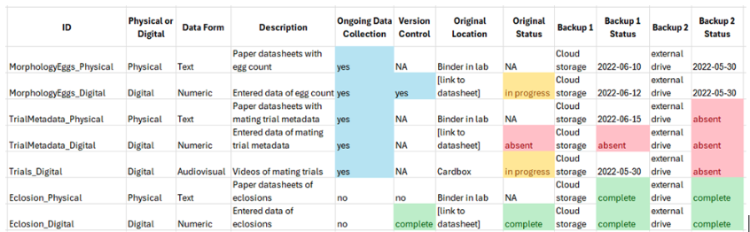

# Planning {#sec-planning}

## Why should you have a data management plan?

Developing a data management plan is an important step to describing, organising, and communicating your data. Your plan may include many components depending on your research needs. Plans may outline roles and responsibilities, and describe how data are collected, structured, documented, stored, and shared. You may also have institutional policies or other requirements based on any funding that you are applying for or have received.

A thorough plan supports a shared understanding and consistent conventions, allowing your project to develop and function as a cohesive whole. One of the major uses of a data management plan is to enable coordinated working and communication among researchers on a project. With the increasing use of consortium projects across institutions, this ensures everyone has a common understanding of what data are being created and used, and under what terms they are available.

But what if things do not go to plan? Good data management is an ongoing and reflective process. Consider your plan a ‘living document’ that is revisited to adapt to new opportunities or changes in circumstance for the full lifecycle of your project, and beyond.

## Start with your data

While it may seem obvious, your starting point in data management plan development is your data. Your data structure dictates your core data model, which then guides naming conventions and folder structures, and how to document and annotate your data (e.g., metadata or required attributes). Strive for internal consistency. It is non-trivial to decide whether names will be in UPPER, lower, snake_case, or CamelCase, and whether you include underscores (\_) or full stops (.) to replace spaces.

The nature of your data collection will also influence how your management plan is structured. A one-time campaign produces a fixed dataset that can be organised and archived once collection is complete. Ongoing data collection, where datasets are updated as new measurements are collected, and long-term monitoring projects require consistent protocols, version control, and procedures for adding new data over time.

Your raw data should be backed up as a read only file with appropriate documentation. You also need to decide whether intermediate and end products will be included in your plan. These data would have been created through some processing steps, so it is a good idea to check out the [BES Reproducible Code](https://www.britishecologicalsociety.org/wp-content/uploads/2025/12/BES-Reproducible-code-guide_2025.pdf) guide too.

::: callout-tip
### How can your library help you with data management?

Most universities have established Research Data Services (RDS) teams specifically designed to support researchers throughout the research and data lifecycle. RDS teams are often embedded within the university library system or research computing units. For large units or departments within a university (e.g., medical schools), there may be in-house data services teams with domain-specific expertise. RDS specialists who often come from academic research backgrounds, possess expertise in various best practices for sharing research data). As such, they are often the most informed on topics like copyright and licensing; supporting documentation and metadata; optimal file formats and organisation; funder and publisher requirements; selecting data repositories; data management and sharing plans; and university policies around handling certain types of data. Most research data teams are relatively public-facing and frequently offer workshops, webinars, and consultations in addition to developing static websites with additional resources. Given the lack of formal training for many students in research data management, researchers of all career stages are encouraged to engage with their local RDS teams where possible.
:::

## Before you start planning

**Requirements**. It is important to understand what your data management plan must do or contain. Each funder will have slightly different requirements but common requirements include: description of the data, quality assurance measures, plans for sharing and re(use), restrictions on sharing (if applicable), copyrights or other intellectual property considerations, storage and backup measures, data management and stewardship roles and responsibilities, and the costs of data management. Institutional policies may further state expectations of good data management and outline any issues you need to be aware of in the implementation of your plan.

**Support**. Institutions have resources that can help throughout the data management process. Training and other resources can often be found on the Library or Information Services pages or provided by a research data service (RDS; Library Box). Discuss any challenges your supervisor, colleagues and collaborators have already faced in their experience – learn from their mistakes.

**Budget**. Data management will have its costs and this should be included within the larger budget of your whole research project. You can use the data lifecycle to help price each activity needed throughout data management in terms of people’s time or extra resources required. Costing tools may be available from universities and other online data management resources. Data management and stewardship activities are increasingly recognised as legitimate and fundable components of research projects, and should be budgeted for accordingly.

::: callout-tip
### Data Management Inventory

As part of a project, you’ll likely have several types of data to keep track of. For example, you may use paper datasheets to collect your data which you then plan to digitise. The physical copies of the paper datasheets, photos of the datasheets, digitised data, and backups of the data are all components of your data management to keep track of, plus each of these may have several backup locations and version control. One way to keep track of all this is with a data management inventory.

The repository below provides a worked example, based on dissertation research on courtship behaviour in flies[^planning-1]. The types of data include formats such as paper datasheets, digitised datasheets, videos of behavioural trials, and photos of counted eggs. The inventory tracks each data component, where it is stored, its backup status, and when each file was last updated. Conditional formatting easily shows when sections need attention, so that data remains up to date.

By updating the data management inventory every time something is added to Backup 1 or Backup 2, we can track what needs to be updated and the location of each piece of data. In this example, the most recent trial was done on 2022-06-15 and a photo of the datasheet was uploaded to cloud storage, but none of the trial metadata has been digitised or backed up, so this is top priority for the research team. If the cloud storage was corrupted and the binder with physical datasheets was lost, all the data would be completely gone.

Explore the repository here: https://osf.io/n26sb/overview
:::

[^planning-1]: Anner, S. C., Ward, R. G., Neubacher, B. & Lackey, A. C. R. Mutual visual displays and female signals underpin mating success in Rhagoletis pomonella flies. 2026. Animal Behaviour.

## Key things to consider when planning

**Time**. Writing a data management plan takes a significant amount of time. But not having a plan may very well take more time! Planning for data management should be thorough before the research project starts to ensure that data management is embedded throughout the research process. Do your future self and your collaborators a favour, and develop a plan now!

**Roles and responsibilities**. Creating a data management plan may be the responsibility of one person, but implementation may involve various people from collaborators to IT staff, backup services and data centres. It is therefore essential to clearly assign roles and responsibilities at the planning stage, rather than merely presuming them. These roles should be actively communicated to avoid problems later in the project, for example researchers at certain government agencies may be limited in how they are allowed to share data. Adopt your own [CRediT taxonomy](https://credit.niso.org/) for data management that assigns responsibility and describes the roles of data collector, manager, engineer, curator, steward, archivist, and more to meet the needs of your project. Discuss and ensure all stakeholders agree on how equitable and appropriate attributions will be provided to everyone.

**Design for use**. Data management should be planned and implemented with the purpose of the research project in mind. Knowing how your data will be used at the end will help in planning the best ways to manage data at each stage of the lifecycle (e.g. knowing how the data will be analysed will affect how the data will be collected and organised).

**Long-term planning**. Your plan should consider what happens after the project ends. Funders, institutions, and increasingly journals expect data to be archived in repositories. You also need to think about how your data may be repurposed, including by other researchers, policymakers, or the public. Assigning an appropriate licence and identifying a long-term steward for the dataset helps clarify how the data can be accessed, cited and maintained over time.

**Review**. Plan how data management will be reviewed throughout the project and adapted if necessary. This will help to integrate data management into the research process and ensure that the best data management practices are being implemented. Reviewing will also help to catch any issues early on, before they turn into bigger problems.

::: border

### Planning checklist

- [ ] Does your data management plan include naming conventions, folder organisation, and documentation?
- [ ] Have you defined and assigned roles and responsibilities identifying who will collect, manage, and archive the data?
- [ ] Has everyone agreed to how they will be provided appropriate attribution in all project outputs?
- [ ] Have you decided how data will be stored, backed up, and accessed throughout the project lifecycle?
- [ ] Do you have plans for long-term sharing and stewardship once the project is complete?
- [ ] Have you set a date (or milestone) for reviewing your plans?
:::
